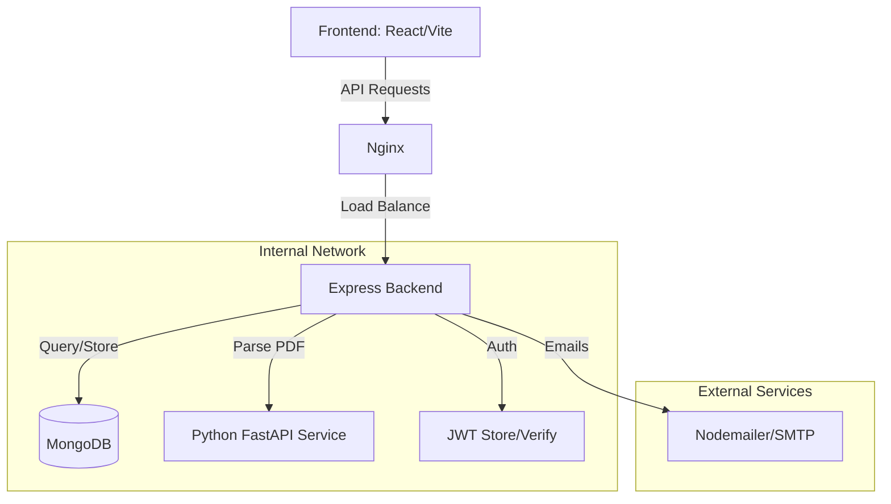

# Acadex: Automated College Result Portal - Architecture Documentation

This document describes the high-level architecture of the Acadex project, a portal designed for automated college result processing and analysis.

---

## 🏗 System Overview

Acadex is a multi-service application consisting of a React-based frontend, a Node.js/Express backend, and a specialized Python service for PDF processing. The system handles student results, subject analysis, and administrative tasks.

### 🌟 Core Features
- **Authentication**: Role-based access (Admin, Faculty, Student).
- **Result Analysis**: Parsing PDF result sheets into structured data.
- **Reporting**: Generating PDF/Excel reports for Course Outcomes (CO) and student performance.
- **File Management**: Secure PDF storage using MongoDB GridFS.
- **Hierarchy Management**: Faculty and student association with departments and subjects.

---

## 🛠 Technology Stack

### **Frontend**
- **Framework**: React.js (Vite)
- **Styling**: Tailored CSS / Components
- **State Management**: React Context API
- **HTTP Client**: Axios
- **Deployment**: Nginx (Dockerized)

### **Backend (Primary)**
- **Runtime**: Node.js
- **Framework**: Express.js
- **Database**: MongoDB (Mongoose ORM)
- **Security**: JWT, Helmet, Rate Limiting, CORS, XSS-Clean
- **File Storage**: MongoDB GridFS (via Multer)
- **Mailing**: Nodemailer
- **PDF/Excel Logic**: PDFKit, ExcelJS, pdf-lib

### **Python Service (Worker)**
- **Framework**: FastAPI
- **Parsing Engine**: `pdfplumber`
- **Purpose**: High-fidelity table extraction from PDF result sheets.

### **Infrastucture**
- **Containerization**: Docker & Docker Compose
- **Server Management**: PM2 (for Node.js clustering)

---

## 📈 Architecture Diagram

### **High-Level Flow**

---

## 📂 Project Structure

### **1. Backend (`/backend`)**
- `controller/`: Business logic for each entity (Auth, Admin, Faculty, PDF).
- `models/`: Mongoose schemas (User, Subject, Result, etc.).
- `routes/`: Express endpoint definitions.
- `middleware/`: Auth guards, error handlers, security filters.
- `services/`: Specialized logic (e.g., GridFS operations).
- `utils/`: Reusable helpers (PDF generators, validation).

### **2. Frontend (`/frontend`)**
- `src/components/`: Modular UI, divided by roles (Faculty, Admin).
- `src/api/`: Axios instances for backend communication.
- `src/context/`: Global states (Auth context).
- `src/hooks/`: Custom React hooks.

### **3. Python Service (`/python-service`)**
- `main.py`: FastAPI endpoints for PDF analysis.
- `Dockerfile`: Container configuration for Python environment.

---

## 🔄 Key Data Flows

### **1. PDF Result Analysis**
1. **Faculty** uploads a PDF result sheet via the Frontend.
2. **Express Backend** receives the file and forwards it to the **Python Service**.
3. **Python Service** uses `pdfplumber` to extract student details and grades.
4. Structured JSON data is returned to the **Backend**.
5. **Backend** processes the results, updates the Database, and stores the original PDF in **GridFS**.

### **2. Course Outcome (CO) Report Generation**
1. User requests a CO analysis report.
2. **Backend** fetches stored grades and subject data.
3. **PDFKit** logic generates a formatted report.
4. Report is sent back to the User for download.

---

## 🔐 Security Architecture
- **JWT Authentication**: Secured routes using Bearer tokens.
- **Input Validation**: `xss-clean` and `express-mongo-sanitize`.
- **Rate Limiting**: Prevents brute-force on API endpoints.
- **CORS**: Strict origin policy for frontend communication.
